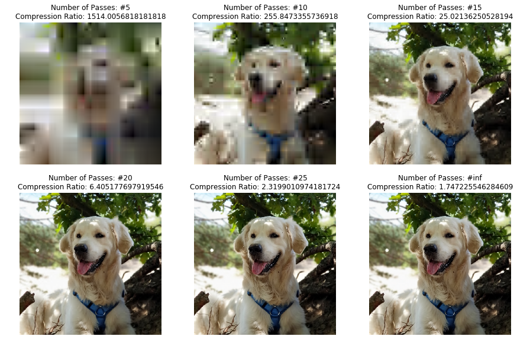

# EZWImageCompression

A Python implementation of an end-to-end image compression system using the Embedded Zero-Trees of Wavelet Transforms algorithm

You can read about it on [Medium](https://medium.com/swlh/end-to-end-image-compression-using-embedded-zero-trees-of-wavelet-transforms-ezw-2362f2a965f7)



## Usage
### Compress an image
```
usage: compress.py [-h] [--output OUTPUT] [--max-passes MAX_PASSES] file

Compress a file to the ZTC format

positional arguments:
  file                  File to compress

optional arguments:
  -h, --help            show this help message and exit
  --output OUTPUT       Output filename
  --max-passes MAX_PASSES
```
### Decompress an image
```
usage: decompress.py [-h] [--output OUTPUT] file

Decompress a file from the ZTC format

positional arguments:
  file             File to decompress

optional arguments:
  -h, --help       show this help message and exit
  --output OUTPUT  Output filename
```
## Credits
Dog photo by [Lilian Joore](https://unsplash.com/@lilian66?utm_source=unsplash&utm_medium=referral&utm_content=creditCopyText) on [Unsplash](https://unsplash.com/s/photos/dog?utm_source=unsplash&utm_medium=referral&utm_content=creditCopyText)
